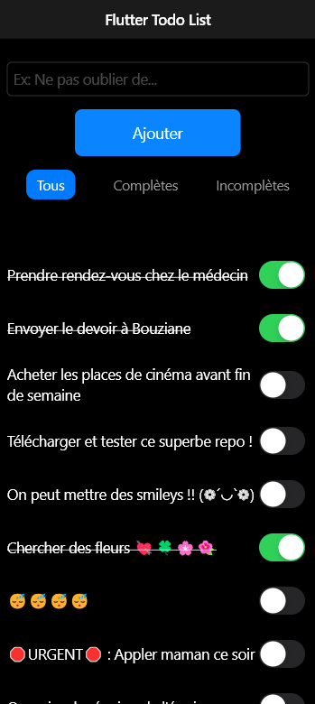

# Flutter Todo List

<div align="center">
    
</div>

## Description

Flutter Todo List est une application simple de gestion de tâches écrite en Dart. L'utilisateur peut ajouter des tâches, marquer des tâches comme terminées, et les supprimer. L'application utilise [shared-preferences](https://pub.dev/packages/shared_preferences) pour sauvegarder les tâches localement, permettant ainsi de conserver les données même après la fermeture de l'application.

## Features

- Ajout de nouvelles tâches
- Marquer les tâches comme terminées
- Suppression des tâches
- Sauvegarde des tâches avec `SharedPreferences`
- Interface utilisateur réactive avec le style Cupertino

## Installation

1. Assurez-vous d'avoir Flutter installé sur votre machine. Vous pouvez suivre les instructions sur [le site officiel de Flutter](https://flutter.dev/docs/get-started/install).
2. **Activez le mode développeur sur Windows :**  
   - Accédez à **Paramètres > Mise à jour et sécurité > Pour les développeurs**.  
   - Activez l'option **Mode développeur**.  
   - Pour plus de détails, consultez la [documentation Microsoft](https://learn.microsoft.com/en-us/windows/apps/get-started/enable-your-device-for-development).
3. Clonez le dépôt :

    ```sh
    git clone https://github.com/alexyvanot/flutter_todo_list.git
    ```

4. Naviguez dans le répertoire du projet :

    ```sh
    cd flutter_todo_list
    ```

5. Installez les dépendances :

    ```sh
    flutter pub get
    ```

## Lancement de l'application

Pour exécuter l'application, utilisez la commande suivante :

```sh
flutter run
```

*Assurez-vous d'avoir un simulateur ou un appareil connecté.*

## Utilisation

Pour utiliser l'application Flutter Todo List :

1. **Ajouter une tâche :**  
   Entrez le titre de la tâche dans le champ de texte et appuyez sur le bouton **Ajouter**. La tâche sera ajoutée à la liste.

2. **Cocher et décocher une tâche :**  
   Appuyez sur le titre d'une tâche pour la marquer comme terminée. Cela barrera le texte de la tâche. Appuyez à nouveau sur le titre pour la décocher.

3. **Supprimer une tâche :**  
   Appuyez longuement sur le titre d'une tâche pour la supprimer de la liste.

La sauvegarde des tâches est automatique. Les modifications sont enregistrées et persistées dans l'application, ce qui signifie que vos tâches resteront disponibles même après la fermeture de l'application.

## License

Ce projet est sous licence MIT. Consultez le fichier [LICENSE](LICENSE) pour plus de détails.
